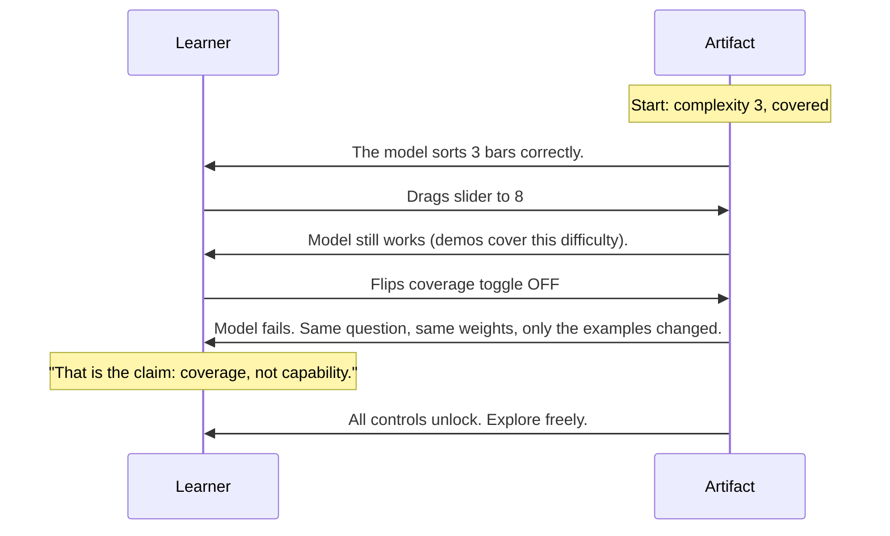
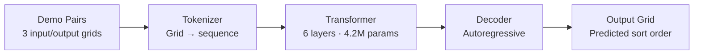
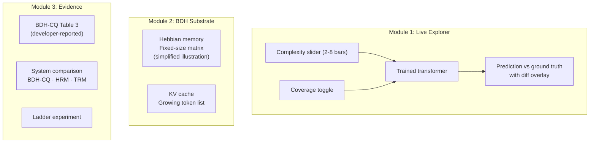
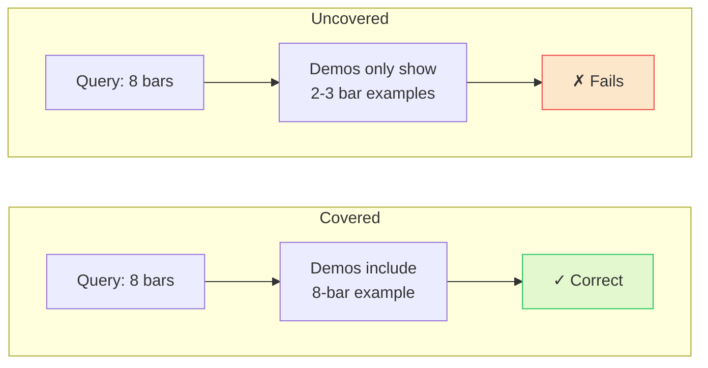
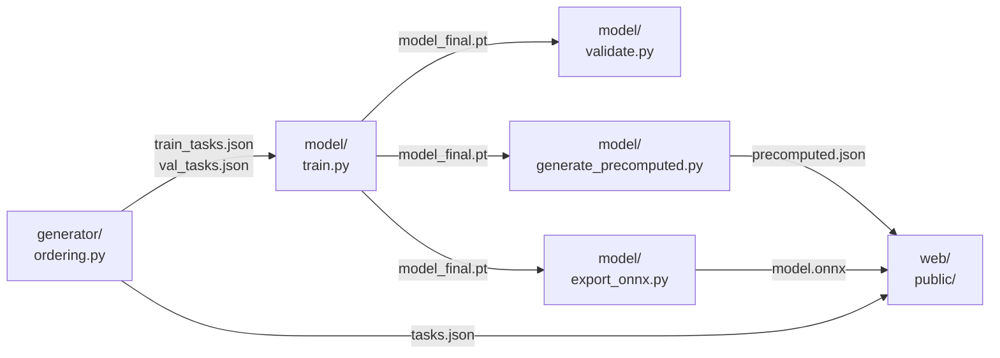

# Demonstration Coverage and Extrapolation

DataForge 2026, Pathway Track

[**Live Demo**](https://web-jet-theta-42.vercel.app) ·
[**Concept Summary (PDF)**](docs/concept-summary.pdf) ·
[**Blog (PDF)**](docs/blog.pdf)

---

## The Claim

A model that learns from demonstrations fails on hard problems. The reason is not a lack of capability. The demonstrations did not cover that difficulty. Adding one demonstration at the harder level restores performance. The weights do not change. The question does not change. Only the examples change.

## How the Demo Works

The artifact opens with a guided walkthrough that takes under 90 seconds.



After the guided flow, a self-test card asks the learner to explain what happened in their own words.

## Architecture



The artifact is a single-page React application with three modules:



| Spec | Value |
|------|-------|
| Model | Decoder-only transformer |
| Layers | 6 |
| Attention heads | 8 |
| d_model | 256 |
| Parameters | ~4.2 million |
| Vocabulary | 13 tokens (colors 0-9, ROW_SEP, GRID_SEP, PAD) |
| Max sequence | 1024 tokens (~776 per task) |
| Training | ~10,500 covered tasks, AdamW, lr 3e-4, ~30 epochs on T4 |

## The Coverage Cliff

The model trains on all complexities (2 through 8) with covered demonstrations. At inference, only the demonstrations change.

| Complexity | Covered EM | Uncovered EM | Gap |
|:---:|:---:|:---:|:---:|
| 2 | 100% | 96% | 4 pp |
| 3 | 100% | 0% | 100 pp |
| 5 | 100% | 0% | 100 pp |
| 8 | 100% | 0% | 100 pp |

**Covered:** at least one of the three demonstrations matches the query complexity.
**Uncovered:** all three demonstrations have at most 3 bars. The query is identical.



This is not a capacity problem. The model has the weights to solve 8-bar tasks. It trained on them. The failure is in the inference-time context: the demonstrations do not cover the query difficulty.

## The Meta-Learning Connection

In-context learning is implicit meta-learning (Von Oswald et al., arXiv:2212.07677, ICML 2023). The distribution of demonstrations matters more than label correctness (Min et al., arXiv:2202.12837, EMNLP 2022). GPT-6 Astra (OpenAI, Sep 2026) and Claude Opus 5 (Anthropic, 2026) use the same mechanism. When a user provides easy examples and asks a hard question, the same coverage failure applies at any scale.

## The BDH Connection

BDH-CQ (arXiv:2608.09888) is a 150M-parameter model that stores demonstrations in a recurrent synaptic state instead of a growing KV cache. It shows the same coverage cliff on the same task family:

| Ordering length 8 | Uncovered | Covered | Source |
|---|:---:|:---:|---|
| pass@1 | 0/24 | 12/24 | arXiv:2608.09888, Table 3 |
| pass@2 | 0/24 | 13/24 | arXiv:2608.09888, Table 3 |

The Hebbian memory module in our artifact is a simplified illustration of the BDH update rule (Pathway BDH Explainer, Chapter 2). It omits low-rank compression, the positional operator, and gating. It is always labeled as such.

## Data Pipeline



## Data Labels

Every output in the artifact is labeled with its source:

- **LIVE** (green badge): ONNX Runtime Web loaded the model and ran inference in the browser.
- **PRECOMPUTED** (orange badge): predictions generated offline from the same model weights. Served as JSON.
- **SYNTHETIC**: all task data is generated by the ordering task generator. No external datasets.
- All BDH-CQ numbers are **developer-reported**, not our reproduction. The evidence table states this.

The badge is always visible in the top-right corner. It never hides the data source.

## Learning Objectives

After using this artifact, the learner can:

1. **Understand** that in-context learning success depends on the complexity range of the demonstrations, not the model's trained capability alone.
2. **Manipulate** a real concept variable (complexity slider, coverage toggle) and observe an immediate consequence.
3. **Compare** model output with ground truth and identify where the model fails (diff overlay).
4. **Describe** how BDH-CQ stores demonstrations differently from a Transformer (recurrent synaptic state vs. growing KV cache).
5. **Explain** the concept in their own words (self-test card after guided flow).
6. **Recognize** at least one limitation: session-scoped adaptation, not durable cross-session learning.
7. **Distinguish** the misconception "the model cannot do this" from "the demonstrations did not reach that far."

These map to the seven learning outcomes on PS page 7.

## Audience

Undergraduate CS students and early-career ML engineers who use few-shot prompting but have not thought about why it fails on hard cases. The reader knows what a neural network does and has given a model examples before asking a question.

## Prerequisites

- A modern browser (Chrome, Firefox, Safari) to use the live artifact
- For local development: Node.js 20+, Python 3.11+, PyTorch 2.x

## Local Setup

```bash
# Clone
git clone https://github.com/wildcraft958/DataForge.git
cd DataForge

# Python dependencies
pip install torch numpy pytest

# Generate task data
python3 -m generator.export --train-seeds 1500 --val-seeds 25 --web-seeds 10

# Run all tests (28 Python + 5 JS)
python3 -m pytest generator/tests/ model/tests/ -v
node --test bdh-toy/tests/hebbian.test.js

# Start the frontend
cd web && npm install && npm run dev

# Note: model.onnx is not committed (too large for git).
# Generate it with export_onnx.py or download from the Vercel deployment.
```

## Training (GPU required)

Use the Colab notebook at `notebooks/train_colab.ipynb`, or run locally:

```bash
# Train (~2-6 hours on a T4)
python3 -m model.train --data data/train_tasks.json --epochs 30 --device cuda

# Validate the coverage cliff
python3 -m model.validate --model checkpoints/model_final.pt --data data/val_tasks.json

# Generate precomputed predictions for the frontend
python3 -m model.generate_precomputed \
    --model checkpoints/model_final.pt \
    --tasks web/public/tasks.json \
    --output web/public/precomputed.json

# Export to ONNX for browser inference
python3 -m model.export_onnx --model checkpoints/model_final.pt --output web/public/model.onnx
```

## Repository Structure

```
DataForge/
├── generator/                 Task generator (Python)
│   ├── ordering.py            Ordering task family: bars sorted by height
│   ├── export.py              Exports tasks.json and precomputed.json
│   └── tests/
│       └── test_ordering.py   8 tests (TDD)
│
├── model/                     Transformer training (Python, PyTorch)
│   ├── architecture.py        Decoder-only, 6 layers, 4.2M params
│   ├── tokenizer.py           Grid → token sequence with separators
│   ├── train.py               Training script (Colab-compatible)
│   ├── validate.py            Validates coverage cliff exists
│   ├── export_onnx.py         PyTorch → ONNX conversion
│   ├── generate_precomputed.py
│   └── tests/                 3 test files
│
├── bdh-toy/                   Simplified Hebbian memory (JS)
│   ├── hebbian.js             ~80 lines, outer-product write + read
│   └── tests/
│       └── hebbian.test.js    5 tests
│
├── web/                       React + Vite + Tailwind frontend
│   ├── src/
│   │   ├── App.jsx
│   │   ├── components/        15 components
│   │   └── hooks/
│   │       └── useOnnxInference.js
│   └── public/
│       ├── tasks.json         10 seeds per complexity for the frontend
│       └── precomputed.json   Offline predictions from same model weights
│
├── notebooks/
│   └── train_colab.ipynb      End-to-end training on Colab GPU
│
├── docs/
│   ├── concept-summary.md     One-page summary (935 words, renders to PDF)
│   ├── concept-summary.pdf
│   ├── blog.md                Blog post (renders to PDF, separate deliverable)
│   ├── blog.pdf
│   └── judge-qa.md            20 anticipated judge questions with answers
│
├── AI_DISCLOSURE.md            AI assistance record
├── LICENCES.md                 Source and license record
└── README.md
```

## Papers Cited

| # | Paper | ID | Role |
|---|---|---|---|
| 1 | BDH-CQ report (Aug 2026) | arXiv:2608.09888 | Table 3, ladder experiments, cost comparison |
| 2 | Dragon Hatchling (Sep 2025) | arXiv:2509.26507 | Architecture, Hebbian derivation |
| 3 | Coconut (Dec 2024) | arXiv:2412.06769 | Latent reasoning baseline |
| 4 | Von Oswald et al. (ICML 2023) | arXiv:2212.07677 | ICL as implicit meta-learning |
| 5 | Min et al. (EMNLP 2022) | arXiv:2202.12837 | Demo distribution over label correctness |
| 6 | HRM (2025) | arXiv:2506.21734 | Adaptation by optimization (contrast) |
| 7 | Recurrent Depth (2025) | arXiv:2502.05171 | Depth sharing (contrast) |
| 8 | Transformer Explainer (CHI 2026) | Georgia Tech | Design precedent: live ONNX in browser |

All 5 primary papers (rows 1-5) are from 2022-2026, cited beside claims. arc-task-gen (pathwaycom/arc-task-gen, MIT) was evaluated and found unsuitable for our task family (targets random ARC tasks, not ordering).

## Credits

- **Team:** NamoFans
- **BDH-CQ evidence:** arXiv:2608.09888, Table 3 (developer-reported, not our reproduction)
- **Design precedent:** Transformer Explainer (Georgia Tech, CHI 2026)

## License

MIT. See [LICENCES.md](LICENCES.md) for third-party components, fonts, and paper citations.
